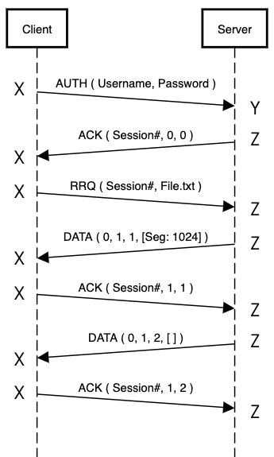
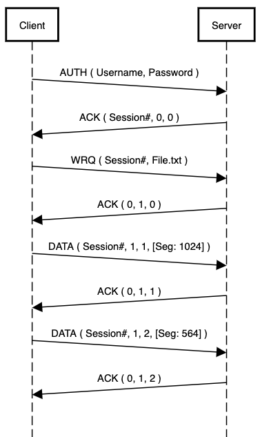
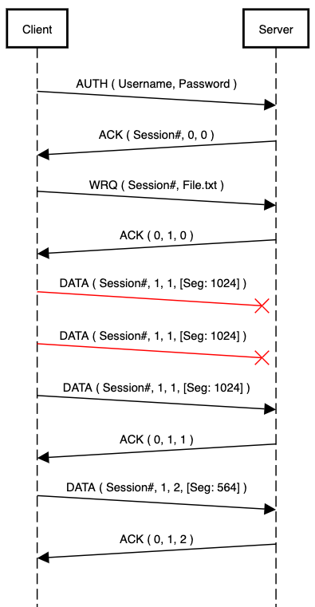
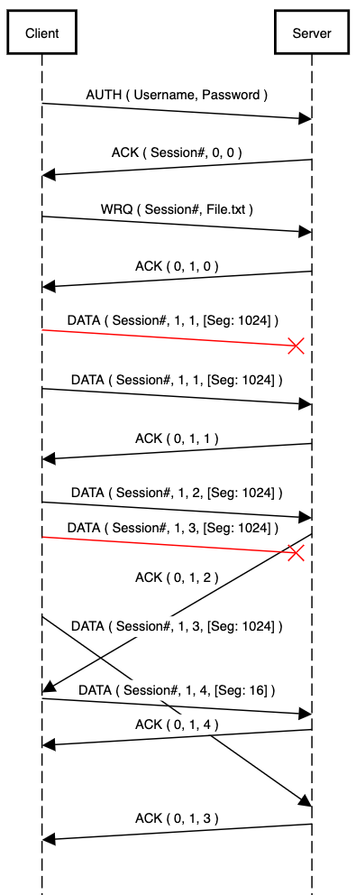

# Easy File Transfer Protocol (EFTP)

## Table of Contents
- [Description](#description)
- [Protocol Specification](#protocol-specification)
    - [Message Structure](#message-structure)
    - [Authentication Phase](#authentication-phase)
    - [Request Phase](#request-phase)
    - [Data Transmission Phase](#data-transmission-phase)
    - [Error Messages and Timeouts](#error-messages-and-timeouts)
- [Sequence Diagram Examples](#sequence-diagram-examples)
- [Personal Notes](#personal-notes)

## Description

Easy File Transfer Protocol (EFTP) is a simple protocol used to transfer files between devices on a network. EFTP is based on the User Datagram Protocol (UDP), instead of the Transmission Control Protocol (TCP) used by FTP.

EFTP is particularly useful for transferring small files, such as configuration files or firmware updates, between networked devices. EFTP employs various mechanisms such as acknowledgments, retransmissions, timeouts, and packet sequencing to ensure reliable data transfer. However, it does not provide advanced security features or encryption of data.

## Protocol Specification

### Message Structure:

| Type | Opcode | Fields                              |
|------|--------|-------------------------------------|
| `AUTH` | 01     | Username (32 max), Password (32 max) |
| `RRQ`  | 02     | Session #, Filename (255 max)        |
| `WRQ`  | 03     | Session #, Filename (255 max)        |
| `DATA` | 04     | Session #, Block #, Segment #, Segment Data (1024 max) |
| `ACK`  | 05     | Session #, Block #, Segment #        |
| `ERROR`| 06     | Error Message (max 512)             |

All messages start with a two-byte opcode (unsigned integer) indicating the type of message. Explicit length fields must be transmitted with zero values if there is no content at the moment, but variable length fields (strings and segment data) can be empty. Any string field in the protocol is followed with a one-byte null field to describe the end of a string.

### Authentication Phase

In EFTP, a transfer is initiated by the client issuing an `AUTH` request to the server to authenticate itself. The client creates a datagram socket and chooses a random port X to communicate with the EFTP server listening on a known port Y. If the provided credentials (username and password) match with the records, the server generates a random positive integer (1∼65535, both boundary values included) as the session number for the current transmission task. Otherwise, the server replys an error message to the client to terminate the transmission with the same server socket uses port Y. After successful authentication, the server creates a separate datagram socket and uses a different random port Z to send back an `ACK` message with the generated session number filled in, but leaves both block number and segment number to zeros. The newly created socket will also be used for all later messages in the session with the connected client (Fig.1). The client should extract the session number from the server `ACK` to use it as proof of its identity for future communications in the same session. All later messages (except for error messages) issued from the client must include the session number to let the server verify its identity. Every later client message (including error messages) should be delivered to, and receive server messages (including error messages) from the new server port Z created for the session. The server also no longer includes the session number in later server messages to prevent impersonation (Fig.1).

### Request Phase

Depending on the user’s choice, either a read request (`RRQ`) or a write request (`WRQ`) is issued after the `ACK` message from the authentication phase is received. The filename field in a read request is used for the server to look up the file in its working directory and transmit the content back to the client. On the other hand, the filename in a write request is used for the server to save the uploaded file with the client- provided name. It’s up to you to either overwrite the file content if it already exists, or send back an error message to terminate the write request. If it is a read request (`RRQ`), the server will start immediately transmitting the first segment of the file that the client has requested using a `DATA` message. But if it is a write request (`WRQ`), the server sends back another `ACK` message to acknowledge the `WRQ` request has been received successfully. In this case, the server needs to set the block number to value 1 but leave the segment number to 0, this is needed to differentiate the current `ACK` from the last `ACK` message.

### Data Transmission Phase  

The unit of data transfer is a block, which is 8 KB (8192 bytes) in size. Multiple blocks are required for files bigger than a block. A sender and a receiver can only have one block at a time in transit. Before transmitting the next block, the previous block must be correctly transmitted and acknowledged. Each block has eight segments, each of which is 1 KB (1024 bytes) in size. These segments can be delivered at any time and in any order (Fig.4), but must indicate which piece they are within the block, so that the receiver can reassemble the entire block back together. This is done using the one-byte segment number field, with possible values 1∼8, indicating the position of the current segment in a block. If the file size is a perfect multiple of the segment size (1 KB), the sender must send another empty `DATA` message to indicate the end of the file (Fig.1). Otherwise, any `DATA` message with segment size less than 1 KB will be considered as the last segment of the file and no empty `DATA` message is needed (Fig.2).

### Error messages and timeouts  

Error messages are not authenticated and can be sent out by any party at any phase of the transmission. Once an error message has been sent out, both sides should terminate the transmission, the server should go idle and the client should exit and both side should report error messages. For retransmission and timeouts, the missed message should be retransmitted before moving on to the next message (TCP-like) (Fig.3). It is suggested to have at least 3 retries and wait for 5 seconds before the packet times out.

## Sequence Diagram Examples  

|  |  |  |  |
| :--: | :--: |  :--: |  :--: | 
| *Figure 1: Complete sequence of downloading ”File.txt” (size: 1024 bytes) from the server under ideal situation* | *Figure 2: Complete sequence of uploading a file to the server and save it as ”File.txt” (size: 1588 bytes) under ideal situation* | *Figure 3: Complete sequence of uploading a file to the server and save it as ”File.txt” (size: 1588 bytes) under ideal situation but the first segment has two retransmissions* | *Figure 4: Complete sequence of uploading a file to the server and save it as ”File.txt” (size: 3088 bytes) under possible real world situation* |

## Personal Notes

This was an assignment as part of a networking course at the University of Calgary (CPSC 441). It was given a pretty tight deadline, and so the code I wrote can be pretty ugly in some parts. At some point I tried to encapsulate the different modules (client, server, session, etc) into classes, but it didn't really clean anything up. Maybe one day I'll come back and try to tidy some of the cruft up, but until then, have fun reading through the caffeine-fueled, stress-powered, spaghetti code written by an average C++ hater.